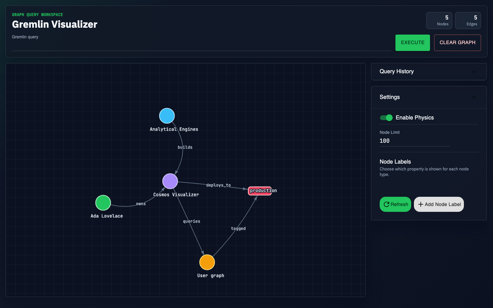
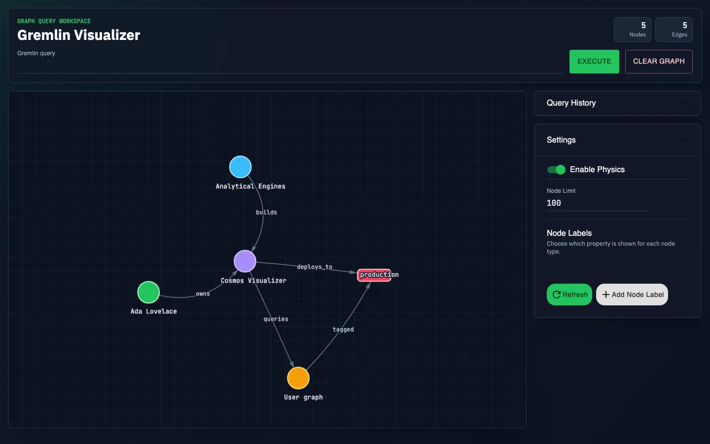
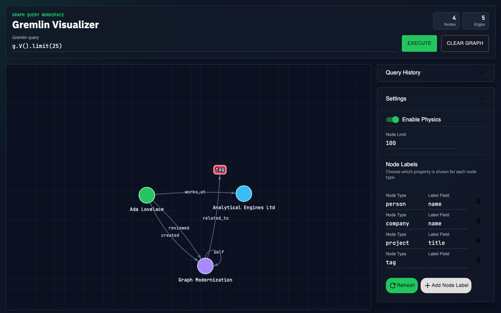
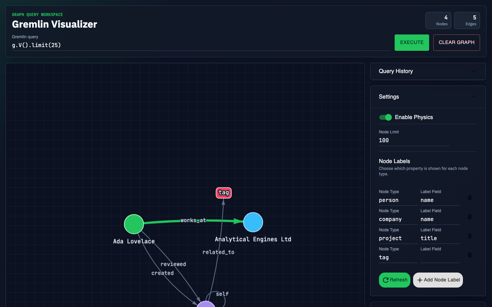

# CosmosVisualizer

[](https://github.com/pinktownscavenger/CosmosVisualizer/actions/workflows/ci.yml)

Cosmos-native Gremlin graph visualization that is credential-free to try with fixture data.

This project is a modernized fork of [prabushitha/gremlin-visualizer](https://github.com/prabushitha/gremlin-visualizer), originally created by Umesh Prabushitha Jayasinghe and released under the MIT License.



CosmosVisualizer is a local React workspace for exploring Azure Cosmos DB Gremlin API graphs. It starts with a credential-free demo graph, lets you run Gremlin vertex queries through a local proxy, renders the returned graph with `vis-network`, and gives you a focused side panel for labels, limits, physics, history, and selected graph details.

## Demo

The fixture-mode demo shows the credential-free query path pulling a graph with `g.V().limit(25)`.



A source H.264 MP4 is also available:

[Watch the demo recording](.github/assets/cosmos-visualizer-demo.mp4)

GitHub does not reliably render committed `.mp4` files inline in README files. For a native inline GitHub video player, upload `.github/assets/cosmos-visualizer-demo.mp4` through a GitHub issue, pull request, or README web-editor attachment flow, then paste the generated `https://github.com/user-attachments/assets/...` URL here on its own line.

## Screenshots

### Fixture Query Result



### Graph Selection



## Try It In Under A Minute

Fixture mode runs without Azure credentials. It uses a built-in sample graph and fixture query responses so you can clone the repo and try the UI immediately.

```sh
npm install --legacy-peer-deps
npm run start:fixture
```

Open:

```sh
http://localhost:5173
```

Run:

```groovy
g.V().limit(25)
```

Fixture mode sets `USE_FIXTURE_DATA=true` for the proxy process. Do not use fixture mode when validating a real Cosmos DB connection.

## Use With Cosmos DB

Requirements:

- Node.js 20 or newer and npm
- Azure Cosmos DB account using the Gremlin API

Copy the example environment file and fill in your Cosmos DB details:

```sh
cp .env.example .env
```

Required server variables:

```sh
COSMOS_ENDPOINT=wss://your-account.gremlin.cosmos.azure.com:443/
COSMOS_PRIMARY_KEY=your-cosmos-primary-key
COSMOS_DATABASE=your-database
COSMOS_CONTAINER=your-graph-container
```

Optional variables:

```sh
CORS_ORIGIN=http://localhost:5173
PORT=3001
VITE_API_BASE_URL=
```

Leave `VITE_API_BASE_URL` blank during local development so the Vite dev server proxies API requests to the local Node server. Set it only when the frontend is served from a different origin than the API proxy.

Start the app:

```sh
npm start
```

The Vite dev server runs on port `5173`; the API proxy defaults to port `3001`.

## Features

- Credential-free startup with a seeded demo graph.
- Fixture mode for pulling a sample graph with `g.V().limit(25)`.
- Cosmos-native query proxy that keeps database credentials server-side.
- Dark graph workspace with node and edge counters.
- Interactive `vis-network` graph rendering with directed edge labels.
- Query history, graph clearing, physics toggling, and node-limit controls.
- Configurable node display labels by vertex type and property field.
- Selected-node and selected-edge inspection with traversal actions.

## How It Works

The project has two local runtime processes:

- A Vite React frontend on port `5173`.
- A Node/Express proxy on port `3001`.

The browser posts `{ query, nodeLimit }` to `/query`. The proxy keeps Cosmos DB credentials server-side, submits the vertex query through the Gremlin driver, fetches adjacent edges for the returned vertices, normalizes the graph payload, and returns it to the UI. In fixture mode, the proxy swaps the real Gremlin client for a static in-memory client while the frontend also starts with a presentational demo graph.

## Query Behavior

Submit Gremlin queries that return vertices, for example:

```groovy
g.V().limit(25)
```

The server applies the configured node limit to the vertex query, then fetches edges adjacent to the returned vertices and sends a normalized graph payload to the frontend.

## Useful Scripts

```sh
npm run client          # Start the Vite frontend
npm run server          # Start the API proxy against Cosmos DB
npm run server:fixture  # Start the API proxy with fixture data
npm run start:fixture   # Start frontend + fixture proxy
npm run build           # Build the frontend
npm test                # Run the Vitest suite
npm audit --omit=dev    # Check production dependency advisories
```

## Docker

Build the image from this repository:

```sh
docker build --tag=cosmos-visualizer:latest .
```

Run it with your environment file:

```sh
docker run --rm \
  -p 5173:5173 \
  -p 3001:3001 \
  --env-file .env \
  --name=cosmos-visualizer \
  cosmos-visualizer:latest
```

To run the container with fixture data instead of Cosmos credentials:

```sh
docker run --rm \
  -p 5173:5173 \
  -p 3001:3001 \
  -e USE_FIXTURE_DATA=true \
  --name=cosmos-visualizer \
  cosmos-visualizer:latest
```

## Security Notes

Do not commit `.env` files or Cosmos DB keys. If a key was ever committed or shared, rotate it in Azure before publishing the repository.

The proxy validates query presence and length, but it intentionally forwards user-provided Gremlin query text to the configured database. Run it only in trusted local or controlled environments unless stronger query authorization, auditing, and network controls are added.

## Release Checks

Before merging to `main`, run:

```sh
npm test
npm run build
node --check proxy-server.js
node --check src/server/app.js
node --check src/server/graphHelpers.js
npm audit --omit=dev
```

Then run `npm run start:fixture` and smoke test query execution, graph rendering, item selection, query history, clear graph, and traversal buttons in the browser.

## License

This project is released under the [MIT License](LICENSE). The original fork attribution is preserved above and in the license file.

## Future Modernization

- Upgrade React and React DOM.
- Migrate Material UI v4 components to the current MUI package family.
- Upgrade or replace `vis-network`.
- Split the Vite bundle if the graph libraries keep the production chunk large.
