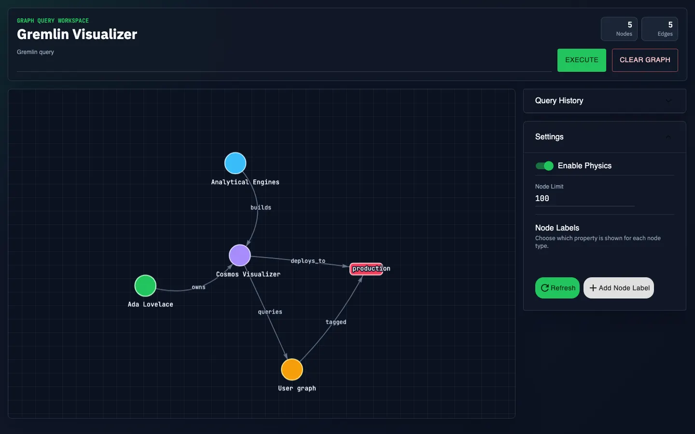
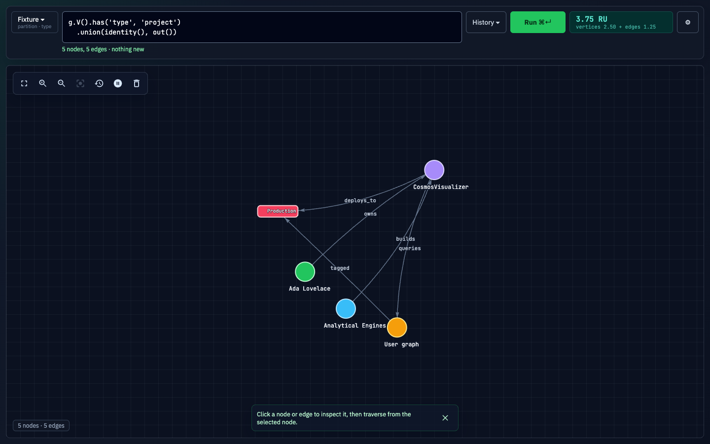

# CosmosVisualizer

[](https://github.com/pinktownscavenger/CosmosVisualizer/actions/workflows/ci.yml)

Cosmos-native Gremlin graph visualization that is credential-free to try with fixture data.

This project is a modernized fork of [prabushitha/gremlin-visualizer](https://github.com/prabushitha/gremlin-visualizer), originally created by Umesh Prabushitha Jayasinghe and released under the MIT License.


CosmosVisualizer is a local React workspace for exploring Azure Cosmos DB Gremlin API graphs. It starts with a credential-free demo graph, lets you run Gremlin vertex queries through a local proxy, renders the returned graph with `vis-network`, and surfaces Cosmos-specific request-unit (RU), partition, and connection context while you explore.

## Demo

The fixture-mode demo shows the credential-free query path pulling a graph with `g.V().limit(25)`.



A source H.264 MP4 is also available:

[Watch the demo recording](.github/assets/cosmos-visualizer-demo.mp4)

GitHub does not reliably render committed `.mp4` files inline in README files. For a native inline GitHub video player, upload `.github/assets/cosmos-visualizer-demo.mp4` through a GitHub issue, pull request, or README web-editor attachment flow, then paste the generated `https://github.com/user-attachments/assets/...` URL here on its own line.

## Screenshots

### Fixture Query Result



### Graph Selection


## Try It In Under A Minute

Fixture mode runs without Azure credentials. It uses a built-in sample graph and fixture query responses so you can clone the repo and try the UI immediately.

```sh
npm install --legacy-peer-deps
npm run start:fixture
```

Open:

```sh
http://localhost:5173
```

Run:

```groovy
g.V().limit(25)
```

Fixture mode sets `USE_FIXTURE_DATA=true` for the proxy process. Do not use fixture mode when validating a real Cosmos DB connection.

## Use With Cosmos DB

Requirements:

- Node.js 20.12 or newer and npm
- Azure Cosmos DB account using the Gremlin API

Copy the example environment file and fill in your Cosmos DB details:

```sh
cp .env.example .env
```

Required server variables:

```sh
COSMOS_ENDPOINT=wss://your-account.gremlin.cosmos.azure.com:443/
COSMOS_PRIMARY_KEY=your-cosmos-primary-key
COSMOS_DATABASE=your-database
COSMOS_CONTAINER=your-graph-container
COSMOS_PARTITION_KEY=type
```

Optional variables:

```sh
CORS_ORIGIN=http://localhost:5173
PORT=3001
HOST=127.0.0.1
VITE_API_BASE_URL=
```

Leave `VITE_API_BASE_URL` blank during local development so the Vite dev server proxies API requests to the local Node server. Set it only when the frontend is served from a different origin than the API proxy.

Start the app:

```sh
npm start
```

The proxy reads `.env` from the project root on startup. Variables already set in your shell take precedence, so `npm run start:fixture` still works with a `.env` that sets `USE_FIXTURE_DATA=false`.

The Vite dev server runs on port `5173`; the API proxy defaults to port `3001`. Both listen on loopback only, so the proxy and your Cosmos key are not reachable from other machines on your network. Set `HOST` only if you deliberately need to expose the proxy. All five Cosmos variables are required for an automatic startup connection. If one is missing or invalid (for example an endpoint that is not a `wss://` URL), the server logs a warning, starts in disconnected mode, and the browser can establish a connection with the **Switch** action.

The partition-key setting accepts a property name such as `type` or `/type`. It is used for partition display, probe construction, and best-effort fan-out advisories; CosmosVisualizer does not infer it from the graph schema.

## Features

- Credential-free startup with a seeded demo graph.
- Fixture mode for pulling a sample graph with `g.V().limit(25)`.
- Cosmos-native query proxy that keeps database credentials server-side.
- In-app connection switching without restarting the local proxy.
- Per-operation RU totals with vertex/edge request breakdowns when Cosmos returns charge metadata.
- Vertex partition-key metadata in table and JSON inspectors.
- Advisory warnings for query patterns and inbound traversals that may fan out across partitions.
- Dark graph workspace with node and edge counters.
- Interactive `vis-network` graph rendering with directed edge labels.
- Query history, graph clearing, physics toggling, and node-limit controls.
- Configurable node display labels by vertex type and property field.
- Selected-node and selected-edge inspection with traversal actions.

## How It Works

The project has two local runtime processes:

- A Vite React frontend on port `5173`.
- A Node/Express proxy on port `3001`.

The browser posts `{ query, nodeLimit }` to `/query`. The proxy submits the vertex query through the Gremlin driver, fetches adjacent edges for the returned vertices, normalizes the graph payload, and returns an envelope with graph data plus available RU diagnostics. `/traverse` uses the same contract for selected-node traversal. `/connection` reports sanitized status and probes candidate connections before atomically replacing the process-wide active client.

One graph operation can make separate vertex and edge requests. CosmosVisualizer sums both charges for the displayed operation total and keeps the breakdown visible; missing provider metadata is reported as unavailable rather than zero. A successful connection switch clears graph data, selection, and the prior operation charge while preserving query text and history. A failed probe leaves the existing connection and graph untouched.

In fixture mode, the proxy uses a deterministic in-memory client with stable request charges and `type` partition values. It exercises the same manager, query, traversal, and diagnostics paths without Azure credentials.

## Query Behavior

Submit Gremlin queries that return vertices, for example:

```groovy
g.V().limit(25)
```

The server applies the configured node limit to the vertex query, then fetches edges adjacent to the returned vertices and sends a normalized graph payload to the frontend. Queries beginning with broad `g.V()` scans, ID lookups without recognized partition scope, and inbound/bidirectional traversal steps can produce informational fan-out advisories. These warnings never rewrite or block a query.

Normalized vertices retain their ordinary properties and also expose dedicated partition metadata. If Cosmos does not return the configured property for a vertex, the inspector says `Partition key value not returned` instead of guessing.

## Connection Switching And Credentials

The compact header status shows `Fixture`, `Disconnected`, or the active Cosmos endpoint host, database, and container. Select **Switch** to enter an endpoint, primary key, database, container, and partition-key property. The server validates and probes the candidate before activating it.

Connection details entered in the UI are held only in memory for this local, single-user process. The primary key is sent once to the local proxy, is never placed in Redux, diagnostics, history, response payloads, or browser persistence, and is cleared from the modal after submission or dismissal. The active Gremlin driver necessarily retains authentication material in server process memory until that connection is replaced or the server stops.

## Useful Scripts

```sh
npm run client          # Start the Vite frontend
npm run server          # Start the API proxy against Cosmos DB
npm run server:fixture  # Start the API proxy with fixture data
npm run start:fixture   # Start frontend + fixture proxy
npm run build           # Build the frontend
npm test                # Run the Vitest suite
npm audit --omit=dev    # Check production dependency advisories
```

## Docker

Build the image from this repository:

```sh
docker build --tag=cosmos-visualizer:latest .
```

`.env` is excluded from the image by `.dockerignore`; pass it at run time instead. Inside the container both processes listen on all interfaces, so publish the ports on loopback to keep them off your network:

```sh
docker run --rm \
  -p 127.0.0.1:5173:5173 \
  -p 127.0.0.1:3001:3001 \
  --env-file .env \
  --name=cosmos-visualizer \
  cosmos-visualizer:latest
```

To run the container with fixture data instead of Cosmos credentials:

```sh
docker run --rm \
  -p 127.0.0.1:5173:5173 \
  -p 127.0.0.1:3001:3001 \
  -e USE_FIXTURE_DATA=true \
  --name=cosmos-visualizer \
  cosmos-visualizer:latest
```

## Security Notes

Do not commit `.env` files or Cosmos DB keys. If a key was ever committed or shared, rotate it in Azure before publishing the repository.

The proxy validates query presence and length, but it intentionally forwards user-provided Gremlin query text to the configured database. The in-app connection API is also intentionally unauthenticated for local single-user operation. Run it only in trusted local or controlled environments unless stronger query authorization, authentication, auditing, and network controls are added.

## Release Checks

Before merging to `main`, run:

```sh
npm test
npm run build
node --check proxy-server.js
node --check src/server/app.js
node --check src/server/connectionManager.js
node --check src/server/gremlinClientFactory.js
node --check src/server/graphHelpers.js
node --check src/server/queryDiagnostics.js
npm audit --omit=dev
```

Then run `npm run start:fixture` and smoke test the Fixture status, deterministic RU totals, query advisories, partition values, graph rendering, item selection, query history, graph clearing, connection modal key clearing, and inbound/outbound traversal diagnostics in the browser.

## License

This project is released under the [MIT License](LICENSE). The original fork attribution is preserved above and in the license file.

## Future Modernization

- Upgrade React and React DOM.
- Migrate Material UI v4 components to the current MUI package family.
- Upgrade or replace `vis-network`.
- Split the Vite bundle if the graph libraries keep the production chunk large.
