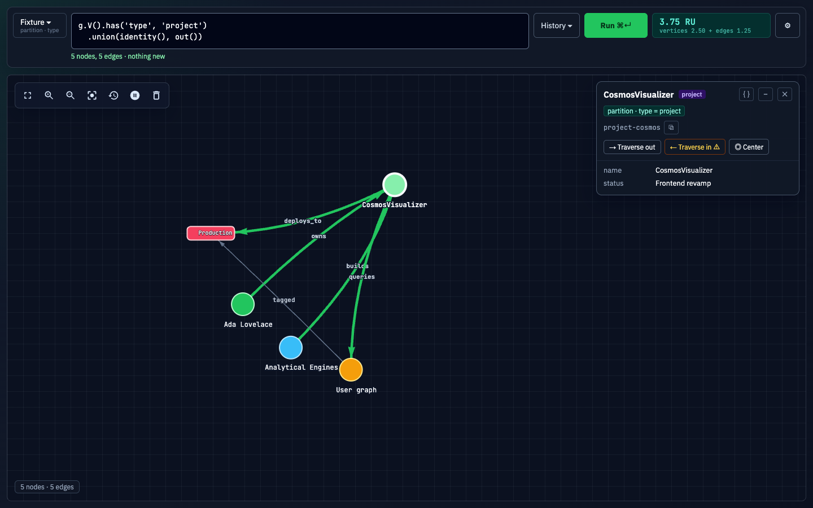
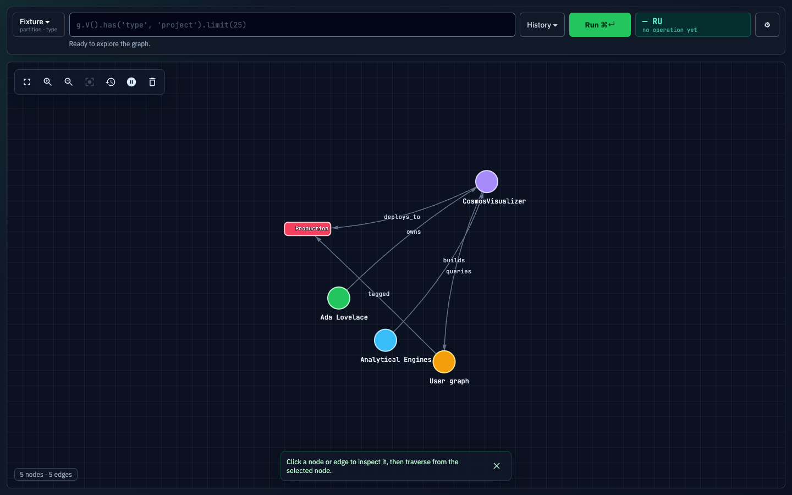

# CosmosVisualizer

[](https://github.com/pinktownscavenger/CosmosVisualizer/actions/workflows/ci.yml)

A local React workspace for exploring Azure Cosmos DB Gremlin API graphs. Run Gremlin vertex queries through a local proxy, see the result rendered with `vis-network`, and keep an eye on request units (RU), partitions, and the active connection while you explore. A built-in demo graph lets you try it without Azure credentials.

This project is a modernized fork of [prabushitha/gremlin-visualizer](https://github.com/prabushitha/gremlin-visualizer), originally created by Umesh Prabushitha Jayasinghe and released under the MIT License.



## Try It In Under A Minute

Fixture mode uses a built-in sample graph and fixture query responses, so no Azure account is needed.

```sh
npm install --legacy-peer-deps
npm run start:fixture
```

Open http://localhost:5173. The demo graph is seeded as soon as the page loads:



Type a query into the top bar and press **Run** (or ⌘↵ / Ctrl+↵):

```groovy
g.V().limit(25)
```

Click a node to open the inspector card, then traverse from it.

Fixture mode sets `USE_FIXTURE_DATA=true` for the proxy process. Do not use it when validating a real Cosmos DB connection.

## Use With Cosmos DB

Requirements:

- Node.js 20.12 or newer and npm
- Azure Cosmos DB account using the Gremlin API

Copy the example environment file and fill in your Cosmos DB details:

```sh
cp .env.example .env
```

Required server variables:

```sh
COSMOS_ENDPOINT=wss://your-account.gremlin.cosmos.azure.com:443/
COSMOS_PRIMARY_KEY=your-cosmos-primary-key
COSMOS_DATABASE=your-database
COSMOS_CONTAINER=your-graph-container
COSMOS_PARTITION_KEY=type
```

Optional variables:

```sh
CORS_ORIGIN=http://localhost:5173
PORT=3001
HOST=127.0.0.1
VITE_API_BASE_URL=
```

Leave `VITE_API_BASE_URL` blank during local development so the Vite dev server proxies API requests to the local Node server. Set it only when the frontend is served from a different origin than the API proxy.

Start the app:

```sh
npm start
```

The proxy reads `.env` from the project root on startup; variables already set in your shell take precedence. The frontend runs on port `5173` and the API proxy on `3001`, both on loopback only, so your Cosmos key is not reachable from other machines. Set `HOST` only if you deliberately need to expose the proxy.

If any of the five Cosmos variables is missing or invalid, the server logs a warning and starts disconnected; you can then connect from the connection chip at the left of the top bar.

The partition-key setting accepts a property name such as `type` or `/type`. It is used for partition display and fan-out advisories; it is not inferred from the graph schema.

## Features

- Credential-free fixture mode with a seeded demo graph. Real Cosmos connections start empty and spend no RUs until you run a query.
- Credentials stay server-side in the local proxy.
- Switch connections in the app without restarting the proxy.
- A single top bar: connection chip, multi-line query editor (⌘↵ / Ctrl+↵ to run, ↑/↓ to recall history), history menu, RU readouts, and settings.
- Per-operation RU totals with vertex/edge breakdowns, plus a session total that resets on a connection switch or when clicked.
- One message line for status, partition fan-out advisories, and errors, with recovery actions such as **Edit query**, **Retry**, and **Switch connection**.
- Full-width canvas with fit, zoom, center, reset, physics, and clear-graph controls.
- A floating inspector card for the selected node or edge: partition chip, copyable id, traversal actions, property values, and a raw JSON view.
- Colour nodes by **Type** or **Partition** from the canvas legend, using colour-blind-safe hues. Vertices whose partition value was not returned are drawn hollow and dashed.
- **Scope to partition** inserts `.has('<partition key>', '')` into an unscoped scan or id lookup (pre-filled from the selected node) without running it.
- Configurable node labels by vertex type and property field.

## How It Works

The browser posts `{ query, nodeLimit }` to the proxy's `/query` endpoint. The proxy runs the vertex query through the Gremlin driver (applying the node limit), fetches edges adjacent to the returned vertices, and returns a normalized graph with RU diagnostics. `/traverse` does the same for traversals from the selected node, and `/connection` probes a candidate connection before replacing the active one.

One graph operation can make separate vertex and edge requests; the displayed total sums both and keeps the breakdown visible. Missing charge metadata is shown as unavailable rather than zero. A successful connection switch clears the graph and selection but keeps query text and history; a failed probe changes nothing.

Broad `g.V()` scans, id lookups without partition scope, and inbound or bidirectional steps produce fan-out advisories. These never rewrite or block a query. If Cosmos does not return the partition property for a vertex, the inspector says so instead of guessing.

When Cosmos rejects a query's syntax, the UI offers **Edit query**; other failures offer **Retry**. The fixture client rejects malformed Gremlin the same way, so error recovery can be tried locally.

## Credentials

Connection details entered in the UI are held only in memory by the local proxy. The primary key is sent once to the proxy and is never stored in app state, history, responses, or browser storage; the dialog clears it after submission or dismissal.

Do not commit `.env` files or Cosmos DB keys. If a key was ever committed or shared, rotate it in Azure.

The proxy forwards your Gremlin query text to the configured database as-is, and the connection API is unauthenticated by design for local, single-user use. Run it only in trusted environments.

## Scripts

```sh
npm run client          # Start the Vite frontend
npm run server          # Start the API proxy against Cosmos DB
npm run server:fixture  # Start the API proxy with fixture data
npm run start:fixture   # Start frontend + fixture proxy
npm run build           # Build the frontend
npm test                # Run the Vitest suite
```

## Docker

```sh
docker build --tag=cosmos-visualizer:latest .
```

`.env` is excluded from the image; pass it at run time. Publish the ports on loopback to keep them off your network:

```sh
docker run --rm \
  -p 127.0.0.1:5173:5173 \
  -p 127.0.0.1:3001:3001 \
  --env-file .env \
  --name=cosmos-visualizer \
  cosmos-visualizer:latest
```

For fixture data instead, replace `--env-file .env` with `-e USE_FIXTURE_DATA=true`.

## License

Released under the [MIT License](LICENSE). The original fork attribution is preserved above and in the license file.
